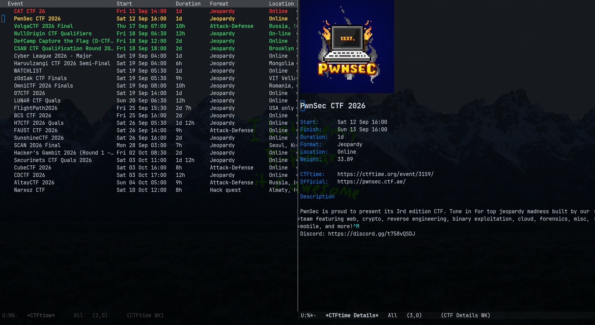

<p align="center">
  
</p>

# 🏴‍☠️ CTFtime for Emacs

A small Emacs plugin for browsing [CTFtime](https://ctftime.org/) events without leaving Emacs. It provides a quick overview of upcoming CTFs, with support for searching, filtering, selecting, and viewing event details, while keeping the option to open an event directly in your browser when needed.

## ⚔️ Features

- Browse upcoming CTFtime events
- Events are highlighted based on when they start
- Search events by name, location, format or description
- Filter events by format and online availability
- View logo and detailed information about an event
- Open the CTFtime page directly with `RET`
- Cache API results to avoid unnecessary requests
- Export the events in Org mode

## 📜 Requirements
- Emacs 27.1+
- A working internet connection

The plugin only relies on Emacs' built-in libraries.

## 🌱 Installation

Clone the repository or copy `ctftime.el` into a directory in your Emacs `load-path`. For example:

```elisp
(add-to-list 'load-path "~/.config/emacs/lisp")
(require 'ctftime)
```

## 🛠️ Configuration

The plugin can be customized through `M-x customize-group RET ctftime`. The main options are:

```elisp
(setq ctftime-days 30)
(setq ctftime-limit 100)
(setq ctftime-cache-duration 3600)
```

`ctftime-days` controls how far into the future events are retrieved, while `ctftime-cache-duration` controls how long API results are kept in memory.

## 🎈 Usage

Run:

```text
M-x ctftime
```

The main buffer provides a simple `tabulated-list` interface. Filters can be combined, so you can for example search for `pwn` while displaying only online Jeopardy CTFs.

| Key     | Action                          |
| ------- | ------------------------------- |
| `RET`   | Open event on CTFtime           |
| `d`     | Show event details              |
| `g`     | Refresh events                  |
| `/`     | Search events                   |
| `o`     | Toggle online-only filter       |
| `t`     | Filter by format                |
| `f`     | Change time range               |
| `c`     | Clear filters                   |
| `SPC`   | Select an event                 |
| `S-SPC` | Select all visible events       |
| `u`     | Clear event selection           |
| `x`     | Export selected events to Org   |
| `q`     | Quit                            |

## 🔍 Search and filtering

ctftime.el provides a flexible free-text search for CTF events. The search is performed across the event title, location, format, and description. Results are updated as you type, without requiring you to press `RET`.

### Basic search
Multiple words are treated as an OR query:
```
pwn web
```

This matches events containing either pwn or web. To require multiple terms, use `&`:
```
pwn & web
```

This matches events containing both pwn and web. Terms can also be negated with `!`:
```
pwn & !crypto
```

This matches events containing pwn but not crypto.

### Regular expressions

Regular expressions can be used by surrounding the expression with `/`:
```
/pwn.*/
```

For example:
```
/pwn.*/ & /web.*/
```

matches events whose searchable text contains both a term matching `pwn.*` and a term matching `web.*`. A negated regular expression is also supported:
```
!/crypto.*/
```

Regular expressions use Emacs' built-in regular expression syntax.

### Combining filters

The text search can be combined with the existing format and online filters. For example:
```
pwn & web
```

with the Jeopardy format filter and Online filter enabled will only show events that:
- contain both pwn and web
- use the Jeopardy format
- are online

## 😒 Testing
The test suite uses Emacs' built-in ERT (Emacs Lisp Regression Testing). Tests are located in `test/ctftime-tests.el`. When adding new functionality or fixing a bug, add a corresponding ert-deftest to this file.

To run the complete test suite:
```
M-x ert RET t RET
```

## ⚖️ License

This project is licensed under the GPL-3.0 License. See the LICENSE file for details.
